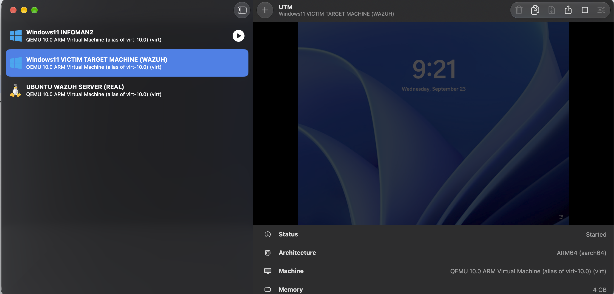
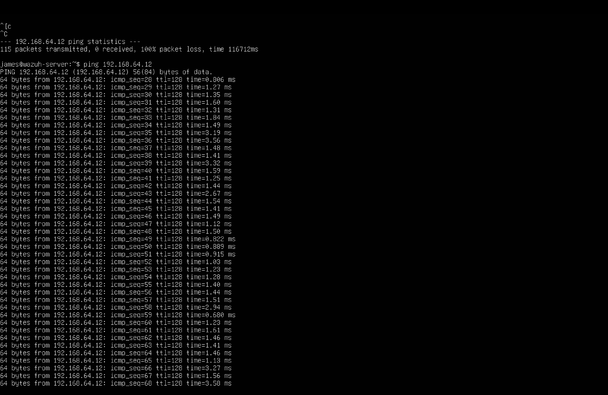
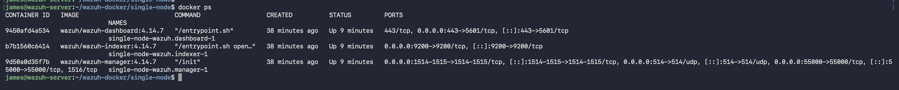
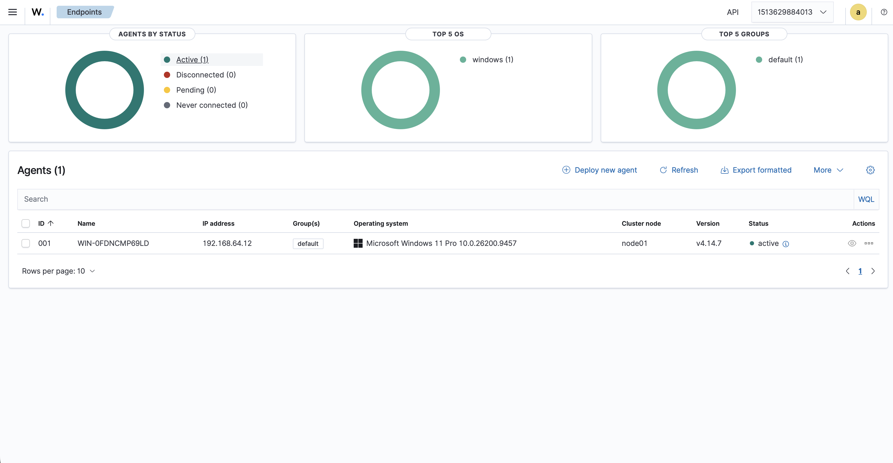
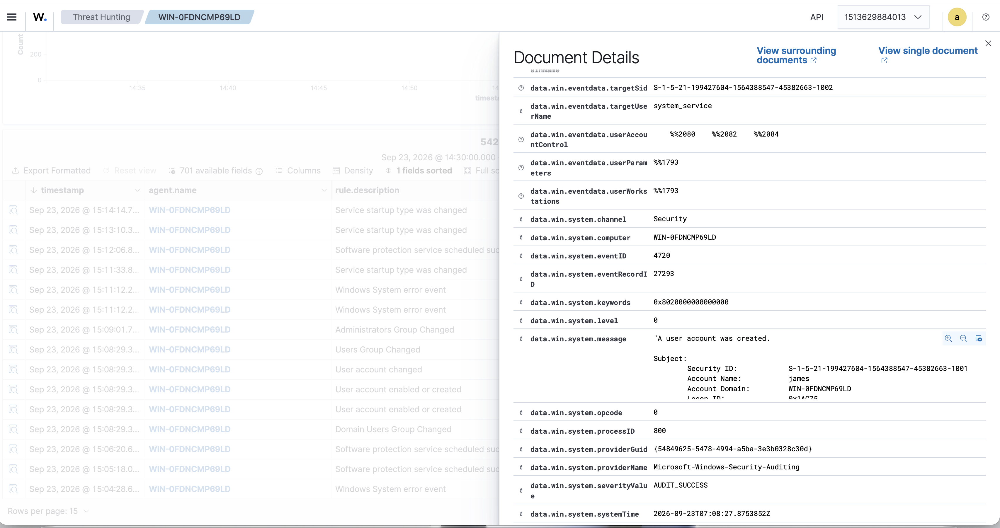
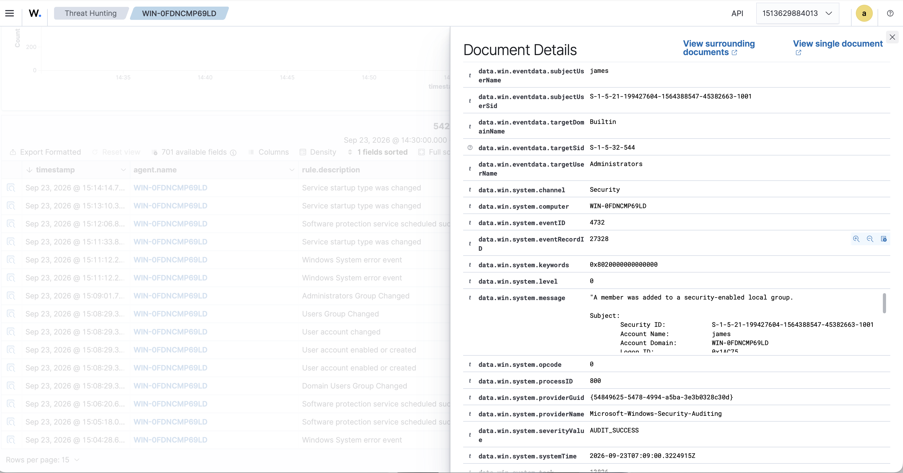
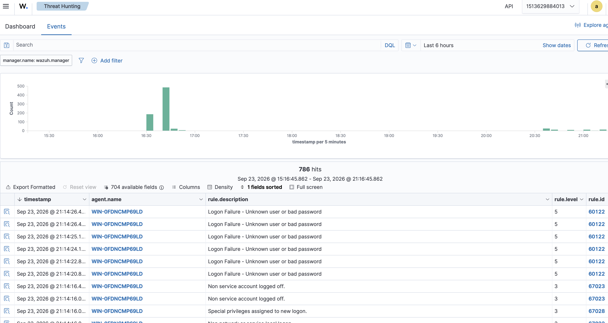
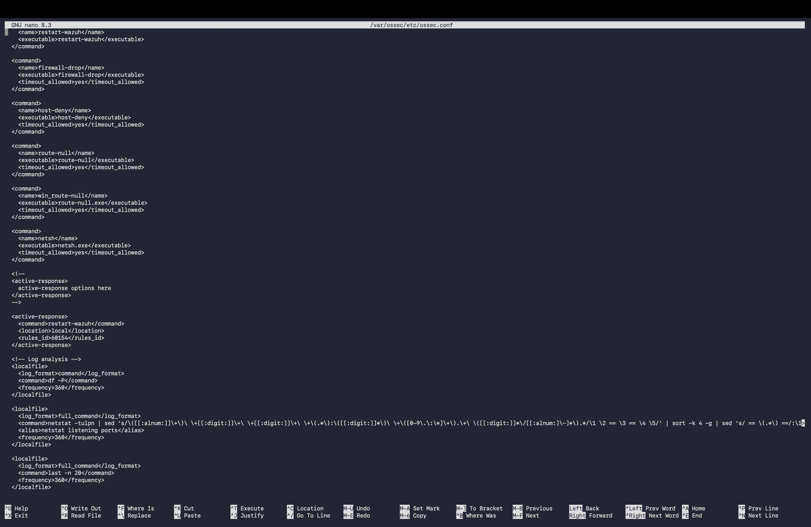
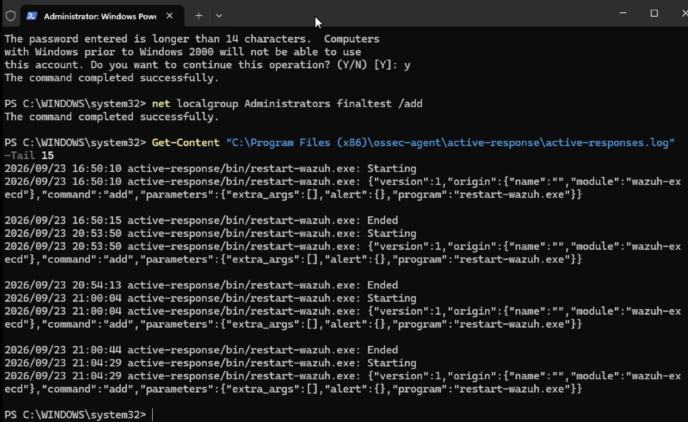
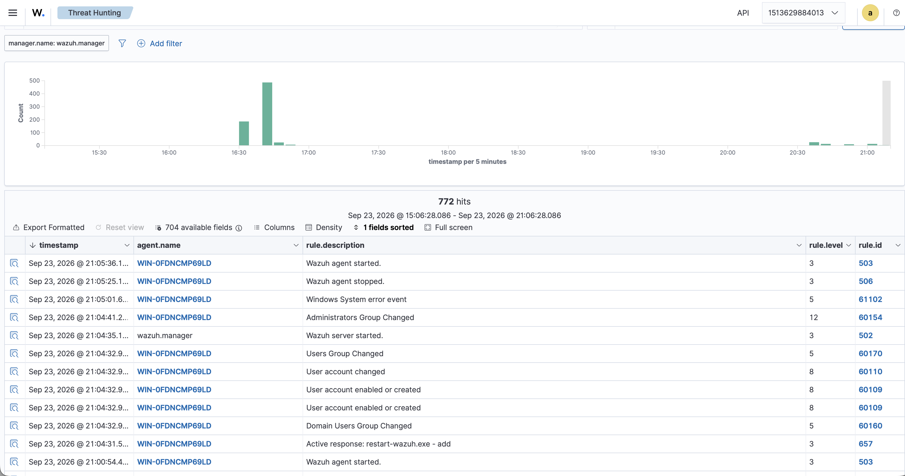

# Wazuh SIEM Home Lab Deployment

## 🛡️ Executive Summary
This project demonstrates the deployment of a Wazuh SIEM environment built from scratch to detect, monitor, and analyze live security threats. The lab simulates real-world adversary behavior (Persistence, Privilege Escalation, and Brute Force attacks) and utilizes custom Active Response scripts to automate threat remediation.

---

## 🏗️ Infrastructure & Architecture
The lab environment was virtualized on Apple Silicon (ARM64) using UTM, requiring specific OS-level tuning and native architecture builds to ensure stability.

* **Hypervisor:** UTM (Apple Silicon / ARM64)
* **SIEM Core (Manager & Indexer):** Ubuntu 22.04 LTS running Wazuh v4.14.7 via Docker
* **Monitored Endpoint:** Windows 11 Pro

### Infrastructure Verification
Before executing attacks, the underlying network, container stack, and agent communication were verified:

**UTM Virtualization Architecture:**

**Network Routing & Connectivity:**

**Wazuh Docker Containers (Manager, Indexer, Dashboard):**

**Windows 11 Agent Successfully Enrolled:**

---

## 🔍 Attack Simulation & Telemetry Analysis

### 1. Threat Hunting: Persistence & Privilege Escalation
To validate telemetry parsing, I simulated a local backdoor creation mimicking an Advanced Persistent Threat (APT) establishing a foothold.

* **The Attack:** Executed a silent local administrator creation via an elevated command prompt on the Windows 11 endpoint:
  * `net user finaltest SecretPass123! /add`
  * `net localgroup administrators finaltest /add`
* **Detection (Event 4720):** Wazuh successfully parsed the Windows Security log, flagging the creation of the `BackupAdmin` account (Rule ID 60109). This maps to **MITRE ATT&CK T1136.001 (Persistence: Local Account)**.
  

* **Privilege Escalation (Event 4732):** Wazuh captured the exact moment the `Builtin\Administrators` group was modified to include the new hidden account.

### 2. Local Brute Force Authentication Attack
To test rapid event correlation, I simulated a brute-force attack on the Windows endpoint.

* **The Attack:** Triggered rapid, successive failed logon attempts at the Windows lock screen.
* **Detection:** The Wazuh Manager ingested the spike in Windows Event ID 4625 (Failed Logon) and successfully clustered the alerts under Rule 60122 (Logon Failure - Unknown user or bad password).

### 3. Vulnerability Management & CVE Scanning
To transition from passive threat detection to proactive risk management, I configured the SIEM to identify unpatched endpoint software.

* **The Configuration:** Enabled the global `<vulnerability-detection>` module in the manager's `ossec.conf` file to download historical and real-time CVE databases (National Vulnerability Database).
* **Endpoint Scanning:** The Windows 11 agent's `syscollector` module gathered the installed software inventory and cross-referenced it against the CVE feeds.
* **Detection:** The SIEM successfully identified endpoint vulnerabilities, flagging 1 High and 2 Medium severity CVEs associated with the QEMU guest agent used for virtualization.

---

## ⚙️ Automated Active Response
The final phase transitioned the environment from passive monitoring to an active defense posture to reduce Mean-Time-To-Respond (MTTR).

* **Configuration:** Modified the manager's global configuration (`ossec.conf`) to whitelist internal infrastructure and link an Active Response block to specific high-severity rules.

* **Execution & Verification:** The Active Response module successfully triggered upon detecting anomalous behavior. The internal `active-responses.log` verified that the automation fired successfully.

---

## 🛠️ Engineering Challenges & Troubleshooting
Building this environment required significant backend systems engineering:

* **Architecture Constraints (`SIGSEGV`):** Encountered a fatal Java runtime segmentation fault. Diagnosed that the packaged AMD64 binaries were failing on Apple Silicon, requiring a full purge and a shift to a native ARM64 Docker deployment.
* **Strict XML Parsing:** During the Active Response configuration, the SIEM manager failed to restart due to XML syntax errors. I utilized a Python XML parser script to dump the stack memory, revealing unclosed `<command>` tags and double root `<ossec_config>` tags, which I then manually corrected in `nano`.

## 💡 SOC Analyst Takeaways
1. **Granular Context:** Investigating raw Windows Event JSON payloads provides context that simple alerts lack. It allows analysts to identify the exact threat actor origin (Subject User) alongside the targeted system entity.
2. **The Power of Automation:** Active response reduces MTTR from hours to milliseconds. However, proper network whitelisting in the `ossec.conf` file is critical to prevent automated remediation from locking out legitimate administrative infrastructure.
3. **Proactive Vulnerability Management:** A SIEM is not just for catching active attacks. By automatically cross-referencing endpoint software inventories against global CVE feeds, a SOC can identify and patch misconfigurations (like outdated VM tools) before an adversary can exploit them.

